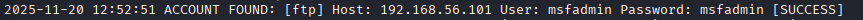
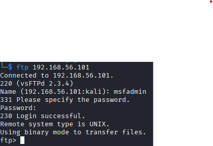
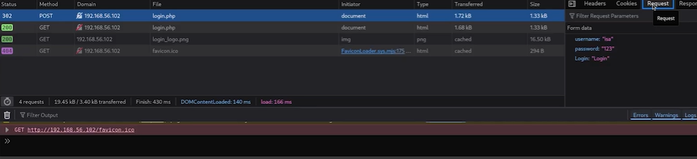
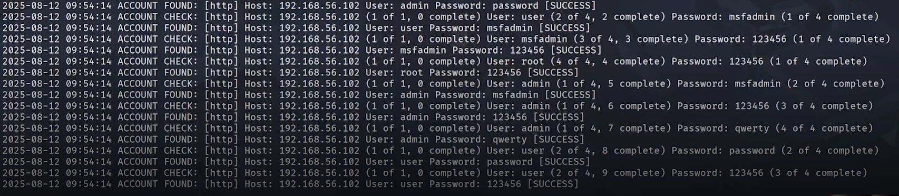
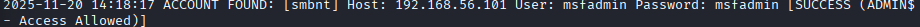
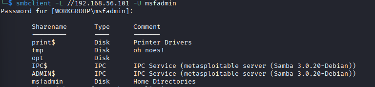

# Brute Force Attack with Medusa and Kali Linux

## 📋 Project Description

This project presents a practical cybersecurity analysis focused on brute force attacks, developed in a controlled environment exclusively for educational purposes. Using the Medusa tool in conjunction with Kali Linux, real attack scenarios were simulated against the Metasploitable 2 system, covering three distinct attack vectors: FTP service (File Transfer Protocol), web form through DVWA (Damn Vulnerable Web Application), and SMB protocol (Server Message Block).

The environment was structured using isolated virtual machines in VirtualBox, configured in a host-only network to ensure total security during testing. Simplified and customized wordlists were developed specifically for educational purposes, allowing for clear demonstration of how authentication vulnerabilities can be exploited through automated attacks.

Beyond the practical execution of attacks, the project documents in detail the entire technical process, from initial environment setup to analysis of obtained results, including proposals for mitigation measures and security best practices. The main objective is to provide a deep understanding of authentication vulnerabilities, offensive security audit techniques, and most importantly, how to protect systems against these threats in the real world.

**Warning:** All activities were performed in an isolated and controlled environment, respecting ethical principles of responsible hacking.

## 🎯 Learning Objectives

- Understand the technical functioning of brute force attacks on different protocols
- Master the use of Kali Linux and the Medusa tool in practical scenarios
- Develop technical documentation skills in information security
- Identify common configuration and authentication failures in systems
- Learn to propose effective countermeasures to protect corporate environments
- Apply ethical hacking principles in a controlled environment

## 🛠️ Technologies Used

- **Operating System:** Kali Linux
- **Main Tool:** Medusa
- **Testing Environment:** Metasploitable 2 / DVWA
- **Virtualization:** VirtualBox

## 🎭 Simulated Attack Scenarios

### Initial Environment Setup

Before initiating any penetration testing, it is fundamental to establish communication between machines and identify the target. For this, the first step was to initialize the Metasploitable 2 virtual machine and obtain its IP address on the internal network.

#### Target Identification

With the Metasploitable VM running, the following command was used in the target machine's terminal to identify its IP address:
```bash
ip a
```

**Identified IP address:** `192.168.56.101`

This IP will be used as the target in all subsequent attack scenarios.

---

#### Port and Service Scanning

After identifying the target's IP, a complete scan was performed to identify open ports and active services on the system. This step is fundamental to map the available attack surface.

**Command executed:**
```bash
nmap -sV -p 21,80,139,445 192.168.56.101
```

**Parameter explanation:**
- `-sV`: Detects versions of running services
- `-p 21,80,139,445`: Specifies the ports to be scanned:
  - **21**: FTP (File Transfer Protocol)
  - **80**: HTTP (Web)
  - **139**: NetBIOS/SMB
  - **445**: SMB (Server Message Block)
- `192.168.56.101`: Target IP address

**Scan result:**

✅ **Identified services:**
- **Port 21:** vsftpd 2.3.4 (FTP)
- **Port 80:** Apache httpd 2.2.8 (HTTP)
- **Port 139:** Samba smbd 3.X (NetBIOS)
- **Port 445:** Samba smbd 3.X (SMB)

All identified services are active and accessible, confirming the attack vectors that will be exploited in subsequent scenarios.

---

### Scenario 1: Brute Force Attack on FTP

#### Objective

Demonstrate how an attacker can compromise the FTP service through automated authentication attempts, exploiting weak passwords or unsafe patterns.

#### Phase 1: Creating Wordlists

To perform the brute force attack, two customized wordlists were created containing common usernames and passwords. Since this is an educational environment, the lists were intentionally kept small to speed up the process and facilitate understanding.

**Creating the user list:**
```bash
echo -e 'user\nmsfadmin\nadmin\nroot' > users.txt
```

**Content of `users.txt` file:**
```
user
msfadmin
admin
root
```

**Creating the password list:**
```bash
echo -e '123456\npassword\nqwerty\nmsfadmin' > passwords.txt
```

**Content of `passwords.txt` file:**
```
123456
password
qwerty
msfadmin
```

> **Note:** In real scenarios, attackers use much more extensive wordlists containing thousands or millions of possible combinations, including variations, dictionaries, and passwords leaked in data breaches.

---

#### Phase 2: Executing the Brute Force Attack

With wordlists prepared and the FTP service confirmed, the attack was executed using the **Medusa** tool, which systematically tests all username and password combinations.

**Command executed:**
```bash
medusa -h 192.168.56.101 -U users.txt -P passwords.txt -M ftp -t 6
```

**Parameter explanation:**
- `-h 192.168.56.101`: Defines the target host (IP) of the attack
- `-U users.txt`: Specifies the file containing the user list
- `-P passwords.txt`: Specifies the file containing the password list
- `-M ftp`: Defines the attack module (FTP protocol)
- `-t 6`: Establishes 6 parallel threads to speed up the process

**How it works:**

Medusa performs login attempts by combining each user from the list with each password from the list, in an automated and parallel manner. The process continues until all combinations are tested or valid credentials are found.

**Attack result:**



✅ **Compromised credentials:**
- **Username:** `msfadmin`
- **Password:** `msfadmin`

---

#### Phase 3: Access Validation

To confirm the success of the attack, a legitimate connection to the FTP server was made using the obtained credentials.

**Command executed:**
```bash
ftp 192.168.56.101
```

When executing the command, the system prompted for authentication credentials:
```
Name: msfadmin
Password: msfadmin
```

**Result:**


✅ **Access confirmed:** Successful login to FTP server, demonstrating that the brute force attack was effective.

---

### Scenario 2: Brute Force Attack on Web Form (DVWA)

#### Objective

Demonstrate how attackers can compromise web applications through automated brute force attacks on authentication forms, exploiting weak passwords and the absence of protections against repeated login attempts.

#### Phase 1: Web Application Reconnaissance

With the Metasploitable server active, the presence of **DVWA (Damn Vulnerable Web Application)** was identified - an intentionally vulnerable web application designed for security training.

**Identified application URL:**
```
http://192.168.56.101/dvwa/login.php
```

To understand how the login form works and prepare the attack, technical analysis of the page was necessary using the browser's developer tools.

#### Phase 2: Authentication Form Analysis

Using the "Inspect Element" function of the browser (F12), it was possible to identify crucial information about the form:

**Information collected:**

1. **HTTP Method:** POST
2. **Target URL:** `/dvwa/login.php`
3. **Form fields:**
   - `username`: Username field
   - `password`: Password field
   - `Login`: Submit button

4. **Error message:** When attempting an invalid login, the application returns the message:
```
   Login failed
```

> **Importance:** The "Login failed" message will be used as a **failure indicator** for Medusa, allowing the tool to identify when an authentication attempt was unsuccessful and continue testing other combinations.

**Identified form structure:**


---

#### Phase 3: Creating Wordlists

Following the same methodology as the FTP attack, customized wordlists were created for the web form attack.

**Creating the user list:**
```bash
echo -e "user\nmsfadmin\nadmin\nroot" > usersDVWA.txt
```

**Content of `usersDVWA.txt` file:**
```
user
msfadmin
admin
root
```

**Creating the password list:**
```bash
echo -e "123456\npassword\nqwerty\nmsfadmin" > passwordsDVWA.txt
```

**Content of `passwordsDVWA.txt` file:**
```
123456
password
qwerty
msfadmin
```

---

#### Phase 4: Executing the Brute Force Attack with Medusa

With all necessary information collected, the attack was executed using Medusa's HTTP module, specifically designed for web form attacks.

**Command executed:**
```bash
medusa -h 192.168.56.101 -U usersDVWA.txt -P passwordsDVWA.txt -M http -m DIR:/dvwa/login.php -m FORM:"username=USER&password=PASS&Login=Login" -m FAIL-LOGIN:"Login failed" -t 6
```

**Detailed parameter explanation:**

- **`-h 192.168.56.101`**: Defines the IP address of the target host (server)
- **`-U usersDVWA.txt`**: Specifies the file containing the list of usernames to be tested
- **`-P passwordsDVWA.txt`**: Specifies the file containing the list of passwords to be tested
- **`-M http`**: Defines the attack module for HTTP protocol (web forms)
- **`-m DIR:/dvwa/login.php`**: Specifies the directory/path of the login page in the web application
- **`-m FORM:"username=USER&password=PASS&Login=Login"`**: Defines the POST form structure, where:
  - `username=USER`: Username field (USER will be replaced by each wordlist entry)
  - `password=PASS`: Password field (PASS will be replaced by each wordlist entry)
  - `Login=Login`: Submit button parameter
- **`-m FAIL-LOGIN:"Login failed"`**: Defines the string indicating authentication failure (used to identify unsuccessful attempts)
- **`-t 6`**: Establishes 6 parallel threads to optimize attack speed

**How it works:**

Medusa performs HTTP POST requests to the login page, sending combinations of username and password. For each response received, the tool checks if it contains the string "Login failed":
- **If contains:** The attempt failed and Medusa continues testing
- **If not contains:** The credentials are valid and the attack was successful

**Attack result:**



✅ **Tested credentials:**
- **Username:** `admin`
- **Password:** `password`

---

#### Phase 5: Access Validation

To confirm the success of the attack, a manual login to the DVWA application was performed using the discovered credentials.

**Validation steps:**

1. Access: `http://192.168.56.101/dvwa/login.php`
2. Enter credentials:
   - **Username:** `admin`
   - **Password:** `password`
3. Click "Login"

**Result:**

✅ **Access confirmed:** Successful login, redirected to DVWA administrative panel.

---

### Scenario 3: Brute Force and Password Spraying Attack on SMB

#### Objective

Demonstrate how attackers can compromise SMB (Server Message Block) file sharing services through user enumeration and automated brute force attacks, exploiting insecure configurations and weak credentials in corporate environments.

#### Phase 1: Reconnaissance and User Enumeration

Unlike previous scenarios, attacking the SMB protocol requires an additional **enumeration phase**. This process allows identifying valid users, available shares, password policies, and other valuable information about the target system before starting the actual attack.

To perform this enumeration, the **enum4linux** tool was used, specialized in extracting information from Windows and Samba systems through the SMB protocol.

**Command executed:**
```bash
enum4linux -a 192.168.56.101 | tee enum4_output.txt
```

**Detailed parameter explanation:**

- **`enum4linux`**: Enumeration tool for SMB/CIFS systems
- **`-a`**: Executes **all** available enumeration options, including:
  - System user enumeration
  - Groups and members enumeration
  - Network shares listing
  - Password policy information
  - Operating system information
  - Domain/workgroup details
- **`192.168.56.101`**: Target address
- **`| tee enum4_output.txt`**: Pipe operator that:
  - Displays output on terminal in real-time
  - Simultaneously saves all output to `enum4_output.txt` file for later analysis

**Relevant information obtained:**

After executing the command, the following were identified:

✅ **Enumerated users:**
- `user`
- `msfadmin`
- `service`
- `root`
- Other system users

✅ **Available shares:**
- `tmp` - Temporary directory
- `IPC$` - Inter-process communication
- Other shares

✅ **Security policies:**
- No account lockout configured
- No password complexity required
- No password expiration

> **Enumeration importance:** This phase is crucial as it provides a list of valid users, significantly reducing the number of attempts needed and increasing attack success rate. Instead of testing random users, the attacker focuses only on accounts that actually exist on the system.

---

#### Phase 2: Creating Targeted Wordlists

Based on information collected during enumeration, more specific wordlists were created, prioritizing identified users.

**Creating the user list:**
```bash
echo -e 'user\nmsfadmin\nservice' > usersSMB.txt
```

**Content of `usersSMB.txt` file:**
```
user
msfadmin
service
```

> **Note:** Different from previous scenarios, this wordlist was built based on real enumeration, containing only confirmed users on the target system.

**Creating the password list:**
```bash
echo -e 'password\n123456\nwelcome123\nmsfadmin' > passwordsSMB.txt
```

**Content of `passwordsSMB.txt` file:**
```
password
123456
welcome123
msfadmin
```

---

#### Phase 3: Executing the Brute Force Attack on SMB

With wordlists prepared and users enumerated, the attack was executed using Medusa's **smbnt** module, specifically designed for SMB/CIFS protocol.

**Command executed:**
```bash
medusa -h 192.168.56.101 -U usersSMB.txt -P passwordsSMB.txt -M smbnt -t 2 -T 50
```

**Detailed parameter explanation:**

- **`-h 192.168.56.101`**: Defines the IP address of the target host (server)
- **`-U usersSMB.txt`**: Specifies the file containing the list of enumerated users
- **`-P passwordsSMB.txt`**: Specifies the file containing the list of passwords to be tested
- **`-M smbnt`**: Defines the attack module for SMB/CIFS protocol (Server Message Block)
- **`-t 2`**: Establishes **2 parallel threads** (simultaneous connections)
  - Reduced value to avoid overloading the target server
  - Reduces chances of detection by monitoring systems
  - Recommended for SMB services that may be sensitive to multiple connections
- **`-T 50`**: Defines the **timeout** of 50 seconds for each connection attempt
  - Maximum wait time for each attempt before considering failure
  - Important for SMB services that may have higher latency

**How it works:**

Medusa performs authentication attempts on the SMB service by combining each user with each password. The SMB protocol uses NTLM authentication, and Medusa's smbnt module simulates this process to test credentials.

**Strategic difference:**
- **Reduced threads (-t 2)**: Unlike FTP which used 6 threads, SMB is more sensitive and may block excessive connections
- **Larger timeout (-T 50)**: SMB may be slower in responding to authentication compared to other protocols

**Attack result:**



✅ **Compromised credentials:**
- **Username:** `msfadmin`
- **Password:** `msfadmin`

---

#### Phase 4: Access Validation to SMB Service

To confirm the success of the attack and verify accessible resources, the **smbclient** tool was used to establish a legitimate connection to the server.

**Command executed:**
```bash
smbclient -L //192.168.56.101 -U msfadmin
```

**Parameter explanation:**

- **`smbclient`**: Command-line client for accessing SMB/CIFS resources
- **`-L`**: Lists all available shares on the server (List shares)
- **`//192.168.56.101`**: Server address in UNC format (Universal Naming Convention)
- **`-U msfadmin`**: Specifies the username for authentication

After executing the command, the password was requested:
```
Enter msfadmin's password: msfadmin
```

**Result:**



✅ **Access confirmed:** Connection successfully established, listing the following shares:

---

## 🛡️ Mitigation Measures

### General Recommendations

#### 1. **Robust Password Policies**

- **Description:** Establish minimum requirements for strong passwords across all systems.
- **Implementation:** Minimum 12 characters, combination of uppercase, lowercase, numbers, and symbols.

#### 2. **Attempt Limitation (Rate Limiting)**

- **Description:** Limit authentication attempts within a determined period.
- **Implementation:** Temporary lockout after 3-5 failed attempts with increasing time. Use Fail2Ban for automation.

#### 3. **Multi-Factor Authentication (MFA/2FA)**

- **Description:** Add a second authentication layer beyond the password.
- **Implementation:** TOTP via apps (Google Authenticator), hardware tokens (YubiKey), mandatory for administrative accounts.

#### 4. **Monitoring and Logging**

- **Description:** Record and analyze authentication attempts.
- **Implementation:** Logs of all attempts, alerts for multiple failures, minimum 90-day retention.

#### 5. **Disable User Enumeration**

- **Description:** Prevent identification of valid users.
- **Implementation:** Generic error messages, disable user listing, block enumeration tools.

#### 6. **Network Segmentation**

- **Description:** Limit access to critical services.
- **Implementation:** Firewall with IP whitelisting, VPN for remote access, VLANs for segregation.

---

### Service-Specific Measures

#### FTP

**Main vulnerabilities:** Weak credentials, plaintext transmission, no attempt limitation.

**Recommendations:**
1. **Migrate to SFTP/FTPS** - Encrypt all transfers 
2. **Configure Fail2Ban** - Block after 3 failed attempts 
3. **Restrict by IP** - Whitelist authorized IPs 
4. **Disable root/admin** - Create specific FTP users 
5. **Implement chroot** - Isolate users in directories 

---

#### Web Applications (DVWA)

**Main vulnerabilities:** Weak credentials, lack of CAPTCHA, revealing error messages.

**Recommendations:**
1. **Implement CAPTCHA** - reCAPTCHA after 2-3 attempts 
2. **Rate Limiting** - Limit 5 attempts per 15 minutes 
3. **WAF** - ModSecurity, CloudFlare, or AWS WAF 
4. **Generic messages** - "Invalid credentials" only 
5. **Account lockout** - After 5 attempts with email recovery 
6. **Security headers** - HSTS, X-Frame-Options, force HTTPS 

---

### Official Documentation

- [Kali Linux – Official Site](https://www.kali.org/)
- [DVWA – Damn Vulnerable Web Application](https://github.com/digininja/DVWA)
- [Medusa – Documentation](http://foofus.net/goons/jmk/medusa/medusa.html)
- [Nmap – Official Manual](https://nmap.org/book/man.html)

## ⚠️ Legal Warning

This project was developed **exclusively for educational purposes** in a controlled environment. 

**IMPORTANT:**
- All tests were performed on isolated virtual machines
- Never use these techniques on systems without explicit authorization
- Misuse of these techniques is **illegal** and may result in criminal consequences
- This material should not be used for malicious activities

---

## 👤 Author

**Phablo Loureiro Alves**
- LinkedIn: https://www.linkedin.com/in/phablo-loureiro-alves/
